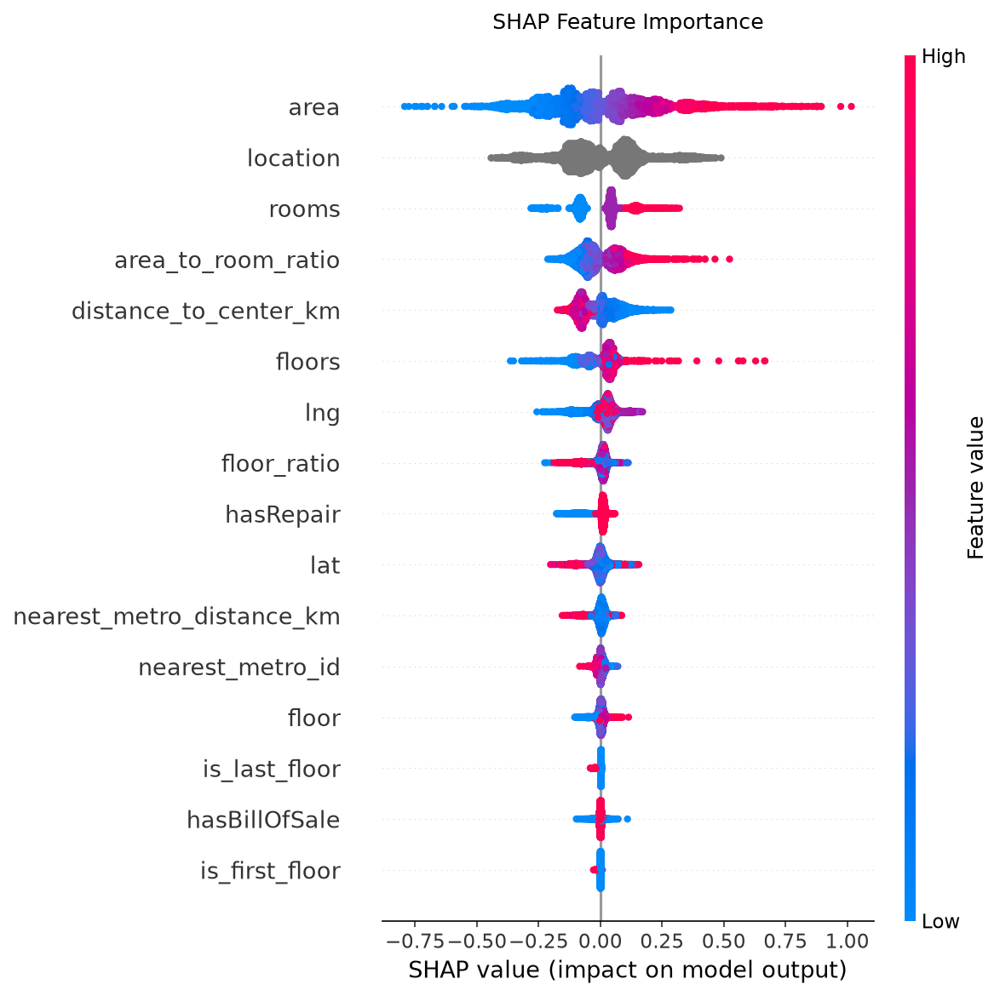

# Baku Apartment Price Prediction

An end-to-end machine learning project to estimate market listing prices for residential apartments in Baku and the Absheron peninsula. 

The dataset contains over 52,000 real estate listings collected from bina.az. The project follows a modular workflow: initial data auditing, row-level sanity cleaning, geospatial and architectural feature engineering, baseline benchmarking across multiple model families, Bayesian hyperparameter optimization, and holdout test set evaluation.

---

## Project Highlights and Results

- Benchmark baseline on raw data (Default LightGBM): MAE 38,409 AZN, MAPE 12.20%, R2 0.8611.
- Final tuned LightGBM on engineered validation split: MAE 26,091 AZN, MAPE 7.98%, R2 0.9148.
- Final evaluation on the untouched 20% holdout test set: MAE 26,754 AZN, MAPE 8.01%, R2 0.8821.
- Error reduction: Over 11,600 AZN reduction in Mean Absolute Error and a 4.19 percentage point drop in MAPE compared to the raw baseline.

---

## Technical Stack

- Language: Python 3.12+
- Package and Environment Management: uv
- Data Manipulation: pandas, numpy, pyarrow
- Machine Learning: scikit-learn, lightgbm, catboost
- Optimization: optuna
- Model Explainability: shap
- Geospatial and Plotting: matplotlib, seaborn, contextily, itables

---

## Data and Cleaning Strategy

The raw dataset contains natural anomalies common in web-scraped real estate data:
- Non-sale transactions: Monthly rentals (e.g., 600 AZN) or initial installment amounts for mortgage assignments (e.g., 12,000 AZN) entered into the price field. Filtered using a price floor (25,000 AZN) and unit price bounds (400 to 15,000 AZN/m²).
- Structural errors: Listings where the apartment floor exceeds total building floors, or area typos (e.g., 1,800 m²). Filtered with logical conditions.
- Missing values: `hasRepair` missingness (0.38%) was validated as missing completely at random (MCAR) via a two-proportion z-test (p = 0.94) and imputed to `False`.

---

## Feature Engineering

Decision trees split on orthogonal, axis-aligned boundaries. Raw latitude and longitude do not capture continuous radial price gradients. The following domain-specific features were engineered:

1. Geospatial Features:
   - `distance_to_center_km`: Geodesic distance (Haversine formula) to Fountains Square (40.3667, 49.8333), capturing the primary urban economic gradient.
   - `nearest_metro_distance_km`: Distance to the closest of 26 Baku metro stations.
   - `nearest_metro_id`: Station identifier of the nearest metro stop, acting as a localized neighborhood anchor.

2. Architectural and Density Features:
   - `floor_ratio`: Relative vertical position calculated as `floor / floors`.
   - `is_first_floor` and `is_last_floor`: Binary indicators capturing market penalties associated with ground and top floor units.
   - `area_to_room_ratio`: Spatial density metric (`area / rooms`).

---

## Experiment Summary

All experiments are tracked persistently in `models/experiments.csv`:

| Model | Dataset | Features | MAE (AZN) | MAPE (%) | RMSLE | R2 | Notes |
|---|---|---|---|---|---|---|---|
| Domain Median | 02_cleaned | 2 | 69,728 | 23.04 | 0.3012 | 0.5393 | Simple lookup baseline |
| LightGBM | 01_raw | 10 | 38,409 | 12.20 | 0.1621 | 0.8611 | Default params, raw data |
| LightGBM | Engineered | 16 | 34,983 | 10.61 | 0.1461 | 0.8685 | 100 trees (under-capacity) |
| LightGBM | Engineered | 16 | 29,634 | 9.09 | 0.1292 | 0.9047 | 1000 trees, 63 leaves |
| CatBoost | Engineered | 16 | 32,065 | 9.77 | 0.1349 | 0.8926 | 1200 iterations, depth 7 |
| **LightGBM (Tuned)** | **Engineered** | **16** | **26,091** | **7.98** | **0.1199** | **0.9148** | **Best validation model (Optuna)** |
| **LightGBM (Holdout)** | **Engineered Test** | **16** | **26,754** | **8.01** | **0.1226** | **0.8821** | **Final holdout test evaluation** |

---

## Shap Feature Importance



---

## Setup and Reproduction

### 1. Clone the repository
```bash
git clone https://github.com/aslanli-aslan/baku-apartment-prices.git
cd baku-apartment-prices
```

### 2. Install dependencies
Using `uv`:
```bash
uv sync
```
Or using standard `pip`:
```bash
pip install -e .
```

### 3. Run the workflow
The notebooks in `notebooks/` are numbered sequentially:
1. `01_eda.ipynb`: Audit distributions and data anomalies.
2. `02_cleaning.ipynb`: Execute sanity filters and export cleaned splits.
3. `03_feature_engineering.ipynb`: Compute spatial distances and export engineered splits.
4. `04_modeling.ipynb`: Run benchmarks, Optuna hyperparameter optimization, and evaluate on the holdout test set.